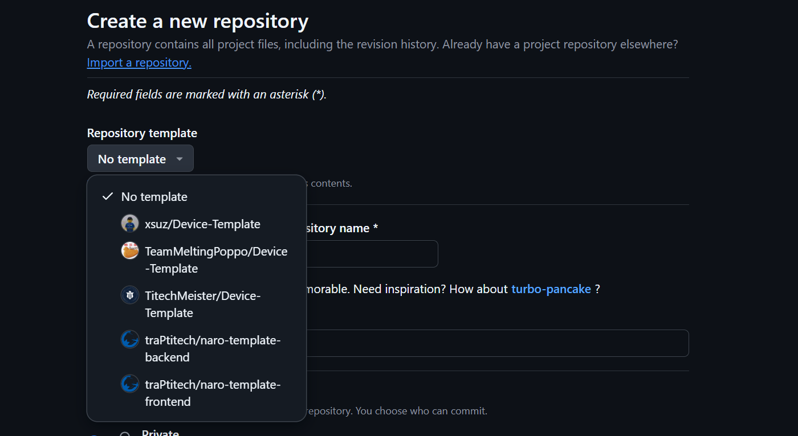

# Device-Template

> A template for building applications for Twelite

This project is developed and maintained by the Team NABA

## Dependencies

To build embedded programs using this template you'll need:

- KiCad Version: 8.0.0, or a newer version.

- Git client

- Github CLI (optional)

## Usage

1. Repositoryを作成するときに、Repository Templateとして`TeamMeltingPoppo/Device-Template`を選択してください。


2. Repository名は、`Device-`から始まる名前にしてください。

3. 作成したRepositoryに移動し、`setup.sh`を実行してください。

```sh
sh ./setup.sh
```

これで、プロジェクトの初期設定が完了しました。


## Using this template with GitHub CLI

```sh
gh repo create ${repo name} --template https://github.com/BirdmanTeamNaba/Device-Template -c
cd ${repo name}
sh ./setup.sh
```

注. 自分のアカウントにRepositoryが作られます。
